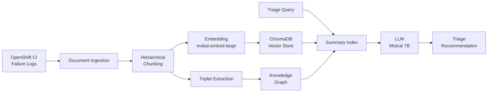

# interop_llm_tools

RAG-powered CI failure analysis pipeline built at Red Hat. Automates triage of OpenShift CI test failures using hybrid retrieval (vector search + knowledge graphs), **reducing mean time to resolution by 40%**.

## How it works



A failure comes in from OpenShift CI. The pipeline ingests the log, chunks it hierarchically, and indexes it in two ways: vector embeddings in ChromaDB for semantic search, and extracted triplets in a knowledge graph for structured relationships between components, errors, and fixes. At query time, a summary index fuses results from both retrievers before the LLM generates a triage recommendation.

## Why hybrid retrieval

Vector search alone misses structural relationships — it finds similar failures but can't reason about *why* component A's failure pattern correlates with root cause B. The knowledge graph captures these relationships explicitly. The summary index layer decides which retriever's results are most relevant per query, so the system gets both semantic similarity and structured reasoning without manual routing.

## Architecture

| Layer | Component | Role |
|-------|-----------|------|
| **Ingestion** | `SimpleDirectoryReader` | Loads CI failure logs from disk |
| **Chunking** | `SentenceSplitter` (1024 tokens) → `HierarchicalNodeParser` (512, 256) | Multi-resolution chunks for both broad context and precise matching |
| **Embedding** | `mxbai-embed-large` via Ollama | Dense vector representations for semantic search |
| **Vector Store** | ChromaDB (`EphemeralClient`) | Fast similarity search over embedded chunks |
| **Knowledge Graph** | `KnowledgeGraphIndex` + `SimpleGraphStore` | Triplet-based structured relationships between CI components |
| **Retrieval** | `SummaryIndex` fusing vector + KG retrievers | Selects and combines results from both retrieval paths |
| **Generation** | Mistral 7B via Ollama / LiteLLM | Produces triage recommendations from retrieved context |
| **Observability** | Arize Phoenix | Tracing, evaluation, and debugging of RAG pipeline |

## Tech stack

| Technology | Why |
|-----------|-----|
| **LlamaIndex** | Orchestration framework — native support for hybrid retrieval, knowledge graphs, and hierarchical chunking |
| **ChromaDB** | Lightweight vector store that runs locally with no external dependencies |
| **Ollama** | Local LLM inference — keeps CI data on-prem, no API calls to external services |
| **LiteLLM** | Model abstraction layer — swap between Ollama, OpenAI, or any provider without code changes |
| **Arize Phoenix** | RAG observability — trace retrieval quality, debug relevance, evaluate pipeline performance |
| **Poetry** | Dependency management with lockfile reproducibility |

## Project structure

```
interop_llm_tools/
├── api.py                  # Public API — complete(), query(), ingest_file()
├── config.py               # Top-level configuration
└── core/
    ├── llm.py              # LLM wrapper with provider abstraction (Ollama/LiteLLM)
    ├── llm_config.py       # Environment-driven config (model, API base, temperature)
    ├── llm_context.py      # RAG pipeline assembly — vector store, KG, retrievers, query engine
    └── common/
        └── llm_api_type.py # Provider enum (Ollama, extensible)
tests/
├── conftest.py             # Shared fixtures
├── test_api.py             # API integration tests
├── test_config.py          # Configuration tests
├── test_llm.py             # LLM wrapper tests
├── test_llm_context.py     # RAG pipeline tests
└── functional_tests/       # End-to-end functional tests
```

## Quick start

### Prerequisites

- Python 3.12
- [Ollama](https://ollama.ai/) running locally
- Mistral 7B and mxbai-embed-large models pulled

```bash
# Pull required models
ollama pull mistral:7b-instruct-v0.2-q4_K_M
ollama pull mxbai-embed-large

# Clone and install
git clone https://github.com/amp-rh/interop_llm_tools.git
cd interop_llm_tools
poetry install

# Configure
export LLM_API_BASE=http://localhost:11434
export LLM_API_TYPE=ollama

# Run tests
poetry run pytest
```

### Usage

```python
from interop_llm_tools.api import get_api
from pathlib import Path

api = get_api()

# Ingest a CI failure log
api.ingest_file(Path("ci-failure-log.txt"))

# Query for triage recommendation
result = api.query("What caused this test failure and how should it be resolved?")
print(result)

# Add known relationships manually
api.update_knowledge_from_triplet(
    subj="network-operator",
    rel="causes_failure_in",
    obj="e2e-metal-ipi"
)
```

## Configuration

All configuration is environment-driven:

| Variable | Default | Description |
|----------|---------|-------------|
| `LLM_API_TYPE` | `ollama` | LLM provider backend |
| `LLM_API_BASE` | — | Provider API endpoint |
| `LLM_INSTRUCT_MODEL_NAME` | `mistral-7b-instruct-v0.2.Q4_K_M.gguf:latest` | Model for generation |
| `LLM_EMBED_MODEL_NAME` | `mxbai-embed-large:latest` | Model for embeddings |
| `LLM_TEMPERATURE` | `0.0` | Generation temperature |
| `LLM_REQUEST_TIMEOUT` | `300` | Request timeout in seconds |
| `CHROMA_COLLECTION_NAME` | `default` | ChromaDB collection name |

## Results

Deployed against Red Hat's OpenShift CI infrastructure, this pipeline reduced mean time to resolution for CI test failures by **40%** compared to manual triage workflows — turning hours of engineer investigation into seconds of automated analysis.

## License

Apache License 2.0
